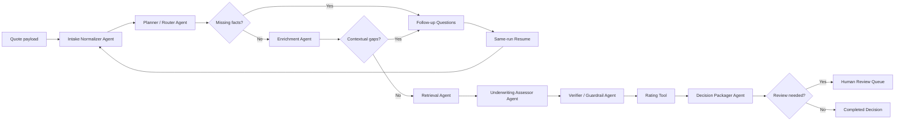

# QuoteCopilot Product and Implementation Spec

## 1. Project Positioning

**Product name:** QuoteCopilot

**Portfolio framing:** QuoteCopilot is a multi-agent insurance underwriting review
system for HO3 homeowner submissions. It turns a raw quote application into a
cited `ACCEPT`, `REFER`, or `DECLINE` decision packet using specialized agents,
retrieval tools, deterministic underwriting rules, rating logic, verification
guardrails, and human-in-the-loop review.

**Week 3 project mapping:** This is a bring-your-own variant of Project 3B,
Multi-Agent Deal Review Pipeline, adapted for insurance underwriting.

## 2. One-Liner

My agent helps insurance underwriters review homeowner quote submissions in a
web app, replacing manual guideline lookup, missing-information follow-up, risk
triage, rating checks, and referral packet preparation. It uses intake,
retrieval, enrichment, underwriting, verification, rating, and review tools on
its own, hands off to a human when information is missing or the risk requires
referral/decline review, and works when an underwriter can get a cited decision
packet in under 3 minutes with reliable reason codes and auditability.

## 3. Target Users

| User | Primary need |
| --- | --- |
| Underwriter | Quickly evaluate eligibility, referral triggers, and risk factors. |
| Producer / agent | Understand what information is missing before a quote can proceed. |
| Review manager | Inspect referred or declined risks with an audit trail. |
| AI / engineering reviewer | Evaluate the agent architecture, state handling, citations, tests, and guardrails. |

## 4. Problem

Homeowner underwriting often requires checking multiple guideline documents,
interpreting eligibility rules, asking for missing facts, assessing hazards,
calculating a premium indication, and documenting the final recommendation. The
manual workflow is slow, inconsistent, and hard to audit.

QuoteCopilot solves this by orchestrating specialized agents around a governed
decision layer. The system can act autonomously for read-only and analytical
steps, but routes uncertain, incomplete, referred, or declined cases to a human.

## 5. MVP Scope

### In Scope

- Accept a structured or legacy homeowner quote payload.
- Normalize it into a canonical HO3 submission.
- Detect missing or uncertain fields.
- Ask targeted follow-up questions.
- Resume the same run after answers are supplied.
- Enrich the risk with deterministic hazard and territory signals.
- Retrieve relevant underwriting guideline chunks.
- Evaluate deterministic underwriting rules.
- Verify that decision outputs are allowed and grounded.
- Calculate a premium indication.
- Produce a structured decision packet with citations, reason codes, facts used,
  confidence, and next steps.
- Create human review tasks for referrals, declines, or verification failures.
- Persist runs, audit events, and review state.
- Provide an interactive demo surface.
- Provide evals for decision accuracy, reason-code match, retrieval recall, and
  citation faithfulness.

### Out of Scope for Week 3

- Real carrier guidelines or real customer data.
- Binding coverage.
- Issuing policies.
- Sending emails to external parties.
- Payment collection.
- Real third-party hazard, credit, or claims integrations.
- Autonomous final approval for declined or referred risks.
- Production identity and access management.

## 6. Agent Framework

| Field | Spec |
| --- | --- |
| Agent goal | Convert a homeowner quote submission into a cited underwriting recommendation and review packet. |
| Where people use it | Streamlit demo and FastAPI endpoints. |
| Steps it takes | Normalize intake, route, pause if missing info, enrich risk, retrieve guidelines, assess rules, verify output, rate, package decision, route to human review when needed. |
| What it can do | Read quote payloads, retrieve guideline chunks, enrich risk profiles, evaluate rules, calculate premium indication, create review tasks, persist audit events. |
| What it remembers | Run ID, quote ID, raw submission, canonical submission, missing questions, supplied answers, node outputs, retrieved citations, decision packet, review status, audit trail. |
| What it should never do | Never bind coverage, issue a policy, deny coverage without a review path, invent citations, use real PII, or override deterministic underwriting rules with LLM text. |
| Human-in-the-loop | Human review is required for missing information, referrals, declines, verification failures, and any final action that changes review status. |
| What happens when something breaks | Retry safe retrieval/model calls where appropriate, fall back to deterministic wording, log the failure, and route to review if confidence or grounding is insufficient. |
| How to know it worked | A demo user can complete accept, missing-info resume, refer, and decline scenarios with cited packets and passing eval metrics. |

## 7. System Architecture

## 8. Agent Responsibilities

### 8.1 Intake Normalizer Agent

**Purpose:** Convert raw input into a canonical HO3 submission and identify
required missing facts.

**Inputs:** Raw quote payload, legacy quote payload, or canonical HO3 payload.

**Outputs:** Normalized submission, missing-info fields, follow-up questions.

**Autonomy:** Can ask clarifying questions; cannot infer required facts when
they are absent or uncertain.

### 8.2 Planner / Router Agent

**Purpose:** Decide the next workflow route based on missing information and
early knockout signals.

**Inputs:** Submission and missing-info list.

**Outputs:** Route such as `waiting_for_info`, `standard`, `hard_refer`, or
`hard_decline_candidate`.

**Autonomy:** Can route to the next node; cannot finalize a decline without
review.

### 8.3 Enrichment Agent

**Purpose:** Add deterministic external-style context such as wildfire band,
flood indicator, territory, and confidence map.

**Inputs:** Canonical HO3 submission.

**Outputs:** Property profile, hazard profile, retrieval plan.

**Autonomy:** Can enrich from deterministic local signals; later versions can
swap in real APIs behind the same tool boundary.

### 8.4 Retrieval Agent

**Purpose:** Retrieve underwriting guideline evidence relevant to the risk.

**Inputs:** Retrieval plan from enrichment.

**Outputs:** Retrieved chunks, source metadata, retrieval metrics.

**Autonomy:** Can search the guideline corpus; cannot cite chunks that were not
retrieved.

### 8.5 Underwriting Assessor Agent

**Purpose:** Apply governed eligibility and referral rules.

**Inputs:** Canonical submission, hazard profile, property profile, retrieved
guidelines.

**Outputs:** Preliminary decision, reason codes, rule findings, facts used,
confidence.

**Autonomy:** Uses deterministic rules as the source of truth. LLMs may assist
with wording but not override rules.

### 8.6 Verifier / Guardrail Agent

**Purpose:** Check whether the assessment and decision packet are allowed,
grounded, and complete.

**Inputs:** Assessment result and citations.

**Outputs:** Verification result, forced decision if needed, review flags.

**Autonomy:** Can force review when evidence or grounding is insufficient.

### 8.7 Rating Tool

**Purpose:** Calculate a premium indication from rating inputs.

**Inputs:** Coverage amount, deductible, territory, construction, roof age, and
hazard factors.

**Outputs:** Premium indication and rating factors.

**Autonomy:** Deterministic only.

### 8.8 Decision Packager Agent

**Purpose:** Create the final structured underwriter-facing packet.

**Inputs:** Assessment, rating result, retrieved evidence, verification result.

**Outputs:** Decision packet with recommendation, confidence, reason codes,
citations, facts used, next steps, review status, and trace reference.

**Autonomy:** Can phrase rationale and next steps; cannot fabricate evidence.

### 8.9 Critic Agent

**Purpose:** Optionally review generated rationale for completeness,
faithfulness, and consistency.

**Inputs:** Draft decision packet, retrieved evidence, rule findings.

**Outputs:** Critique result and revision suggestions.

**Autonomy:** Can request revision or route to review; cannot change the
governed decision by itself.

## 9. State Model

Each run should carry durable state across the workflow:

| State field | Description |
| --- | --- |
| `run_id` | Stable workflow run identifier. |
| `quote_id` | User-facing quote identifier. |
| `status` | `processing`, `waiting_for_info`, `pending_review`, `completed`, or `failed`. |
| `current_node` | Current workflow node for traceability. |
| `submission_raw` | Original payload. |
| `submission_canonical` | Validated HO3 submission. |
| `missing_info` | Required unresolved fields. |
| `required_questions` | Human-facing follow-up questions. |
| `additional_answers` | Answers supplied during resume. |
| `enrichment` | Property and hazard enrichment. |
| `retrieval` | Retrieved guideline chunks and metrics. |
| `assessment` | Rule findings and preliminary decision. |
| `verification` | Guardrail and grounding result. |
| `rating` | Premium indication and factors. |
| `decision_packet` | Final underwriter-facing output. |
| `events` | Ordered audit events across the run. |

## 10. Human-in-the-Loop Rules

Human review is mandatory when:

- Required intake facts are missing or uncertain.
- Contextual wildfire mitigation evidence is required.
- The preliminary decision is `REFER`.
- The preliminary decision is `DECLINE`.
- Verification blocks or downgrades the decision.
- The system cannot retrieve relevant evidence.
- The LLM output is invalid after retry/fallback.

Human users can:

- Answer follow-up questions.
- Approve a referred decision.
- Override with documented rationale.
- Request additional information.
- Close or reopen a review task.

## 11. Failure Handling

| Failure | Expected behavior |
| --- | --- |
| Missing required fields | Pause run, generate questions, preserve run state. |
| Invalid payload | Return validation error with field-level details. |
| Retrieval returns no chunks | Continue only if deterministic rules can support the decision; otherwise route to review. |
| LLM structured output fails | Retry, then use deterministic fallback wording. |
| Critic rejects rationale | Revise if retry budget remains; otherwise route to review. |
| Rating input incomplete | Use available deterministic defaults only if documented; otherwise route to review. |
| Database write failure | Return failure status and log enough context for recovery. |

## 12. Tools and Data

| Tool / data source | Purpose | Current implementation target |
| --- | --- | --- |
| Guideline corpus | Source-grounded underwriting evidence | Markdown documents under guideline corpus. |
| RAG engine | Retrieve citation-grade chunks | Lexical, semantic, or hybrid retrieval. |
| Underwriting rules | Governed eligibility source of truth | Deterministic rule module. |
| Rating tool | Premium indication | Deterministic rating module. |
| HITL workflow | Review queue and follow-up handling | Review endpoints and SQLite persistence. |
| LLM service | Missing-info wording and rationale support | Structured output with fallback. |
| Critic service | Independent review of generated rationale | Optional second-model critic. |
| Observability | Latency, events, trace refs | Local logs/traces and eval reports. |

## 13. API Surface

Minimum endpoints for the Week 3 demo:

| Method | Path | Purpose |
| --- | --- | --- |
| `GET` | `/health` | Service readiness. |
| `POST` | `/quote/ho3` | Start a canonical HO3 underwriting run. |
| `POST` | `/quote/run` | Start a legacy quote run. |
| `GET` | `/runs` | List recent runs. |
| `GET` | `/runs/{run_id}` | Inspect run state and decision packet. |
| `GET` | `/runs/{run_id}/audit` | Inspect node-by-node audit trail. |
| `POST` | `/runs/{run_id}/answers` | Resume a paused run with missing-info answers. |
| `GET` | `/reviews/pending` | List open human review tasks. |
| `GET` | `/reviews/{run_id}` | Inspect a review packet. |
| `POST` | `/reviews/{run_id}/actions` | Approve, reject, request info, or close a review. |

## 14. Demo Scenarios

### Scenario 1: Straight-Through Accept

Input has complete, low-risk HO3 data. QuoteCopilot normalizes the submission,
retrieves guidelines, applies rules, rates the risk, and returns an `ACCEPT`
packet with citations.

### Scenario 2: Missing Information Pause and Resume

Input omits `roof_age_years`. QuoteCopilot pauses, asks for roof age, stores the
run, resumes after the answer is supplied, and completes the decision using the
same `run_id`.

### Scenario 3: Wildfire Mitigation Follow-Up

Input has a high wildfire signal. QuoteCopilot asks for mitigation evidence,
resumes after the answer, and routes to review if the evidence is insufficient
or referral rules apply.

### Scenario 4: Decline / Referral Review

Input triggers a severe rule such as prohibited occupancy, severe hazard, or
eligibility knockout. QuoteCopilot creates a decision packet and routes it to the
human review queue rather than silently finalizing.

## 15. Evaluation Plan

| Metric | Target |
| --- | ---: |
| Decision accuracy | At least 95% on labeled synthetic cases. |
| Reason-code exact match | At least 90%. |
| Retrieval recall@5 | At least 90% for evidence-backed cases. |
| Citation faithfulness | 100% for cited chunks. |
| Missing-info detection | At least 95% on required-field cases. |
| Resume correctness | 100% same-run resume for supported questions. |
| Product tests | All passing before demo recording. |

Evaluation dataset should include:

- Accept cases.
- Refer cases.
- Decline cases.
- Missing roof age.
- Missing occupancy.
- Wildfire evidence required.
- Flood-risk referrals.
- Liability exposure referrals.
- Claims-history referrals.
- Unsupported or invalid payloads.

## 16. Implementation Plan

### Phase 1: Rename and Position

- Update README and demo copy from Agentic Underwriter to QuoteCopilot.
- Keep `AgenticUnderwriter` as the repository name if desired; use QuoteCopilot
  as the product name.
- Add the one-liner and Week 3 framing to the README.

### Phase 2: Strengthen Agentic Evidence

- Make each workflow node explicit in docs and traces.
- Ensure run state records `current_node` and node outputs.
- Add or refine audit events for pause, resume, retrieval, verification, rating,
  packaging, and review creation.

### Phase 3: Improve Human Review

- Ensure pending review tasks include decision, reason codes, questions,
  citations, and priority.
- Add demo actions for approve, request more information, and close review.

### Phase 4: Polish Demo

- Streamlit first screen should show the QuoteCopilot workflow, sample cases,
  decision packet, citations, audit trail, and HITL status.
- Include four demo scenarios from this spec.
- Add a one-command walkthrough script for repeatable video recording.

### Phase 5: Validate

- Run product tests.
- Run the labeled eval dataset.
- Capture metrics in README.
- Record a demo under 5 minutes showing happy path, pause/resume, and human
  review.

## 17. Submission Package

The final Week 3 submission should include:

- GitHub repo link.
- Short project doc explaining the goal, architecture, data, prompts, iterations,
  limitations, and learnings.
- Demo video under 5 minutes.
- Sample decision packets.
- Evals and test results.
- Architecture diagram.
- Clear statement that synthetic data and synthetic guidelines are used.

## 18. Resume Bullet

Built QuoteCopilot, a multi-agent insurance underwriting review system that uses
RAG, deterministic underwriting rules, structured decision packets,
human-in-the-loop review, citation validation, model comparison, and eval-driven
quality checks to produce auditable `ACCEPT`, `REFER`, and `DECLINE`
recommendations for HO3 homeowner submissions.
